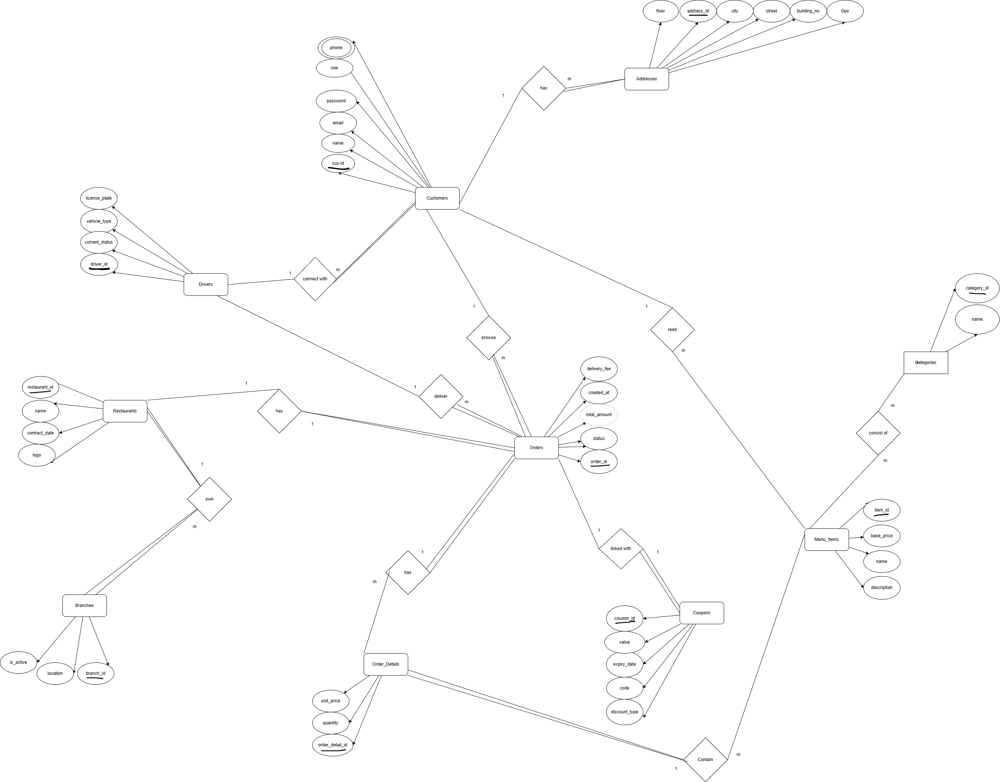

# 🍔 Talabat Database Management System

A comprehensive SQL Server project simulating the backend of the **Talabat** food delivery platform. This project demonstrates advanced skills in relational data modeling, data integrity, and business intelligence (BI) analytics.

---

## 📊 Database Design & ERD
Visual representation of the system architecture and entity relationships:

---

## 🛠️ Key Features
- **Relational Schema:** Optimized tables for Restaurants, Customers, Orders, Drivers, and more.
- **Data Normalization:** Ensuring data consistency and reducing redundancy.
- **Business Intelligence:** 20+ Complex SQL queries providing actionable insights for business owners.

## 📂 Project Structure
- `Talabat_Database_Setup.sql`: Full DDL & DML script to create the database and populate sample data.
- `20_Business_Analytics_Queries.sql`: A collection of high-level analytical queries for financial and operational reporting.
- `Talabat_ERD.png`: The Entity Relationship Diagram.

## 🚀 Technical Skills Demonstrated
- **Advanced T-SQL:** Joins, Subqueries, Aggregations, and Case statements.
- **Business Analytics:** Revenue tracking, Driver efficiency, and Customer behavior analysis.
- **System Design:** Creating a scalable database for a real-world use case.

---
*Developed as part of my SQL Development Portfolio.*
